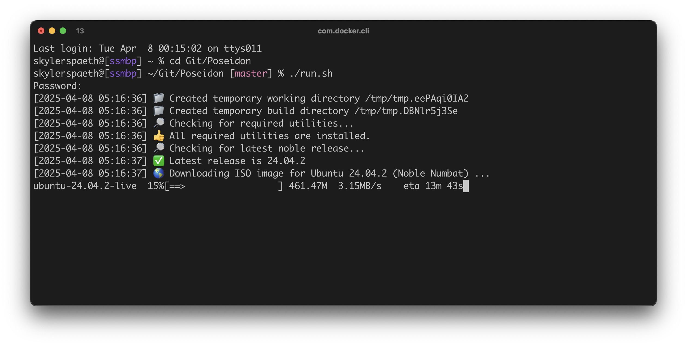

# Poseidon

Poseidon is a tool to create an Ubuntu ISO which bundles in an `autoinstall.yaml`.



## Usage
First, run `build.sh` to generate the Docker image which `run.sh` uses.
```bash
./build.sh
```

Then, ensure your `autoinstall.yaml` is in the repo's `data` directory, and execute the run script:
```
./run.sh
```
